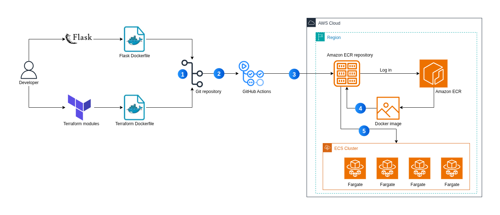

<!-- markdownlint-disable MD033 -->
<h1 align="center">FilesOnCloud - Elegant Simplicity in File Sharing</h1>
<!-- markdownlint-enable MD033 -->

[](https://forthebadge.com)
[](https://forthebadge.com)
[](https://forthebadge.com)

[](https://www.terraform.io/)
[](https://aws.amazon.com/)
[](https://github.com/features/actions)
[](https://flask.palletsprojects.com/)
[](https://docs.pytest.org/)
[](https://www.docker.com/)


[](http://makeapullrequest.com)

FilesOnCloud is a web application that enables users to share files on a shared platform. Authenticated users can upload, download, view, search, and delete files, while guest users can only view and search files.

## Features

1. User authentication using Amazon Cognito.
2. Flask session state management and file display caching using Redis.
3. File upload to Amazon S3 via multipart upload.
4. Secure file downloads through Amazon CloudFront signed URLs.
5. File metadata stored in Amazon DynamoDB via AWS Lambda and API Gateway.
6. Secrets handling using AWS Secrets Manager and Parameter Store.
7. Application deployment to Amazon ECS (Fargate) using Amazon ECR and GitHub Actions.
8. View the 15 most recently uploaded files with download and delete options.
9. Delete files from Amazon S3 with corresponding metadata removed from DynamoDB.
10. File search functionality.
11. User account deletion.
12. Guest user access - limited to viewing and searching files.

## Architecture



1. **Code Commit** - Developer pushes Flask app code and Terraform modules, triggering the CI pipeline.
2. **GitHub Actions** - Orchestrates build, test, and deployment; runs Terraform to provision/update AWS resources.
3. **ECR Authentication** - GitHub Actions authenticates with Amazon ECR to push Docker images.
4. **Docker Build & Push** - Flask and Terraform Dockerfiles are built into images and pushed to ECR.
5. **ECS Deployment** - New images are deployed to ECS Fargate, updating the running application.

## Tech Stack

| Layer | Technology |
|---|---|
| Backend | Python 3.11+, Flask 3.1, Gunicorn |
| Auth | Amazon Cognito |
| Storage | Amazon S3, Amazon DynamoDB |
| CDN | Amazon CloudFront |
| Compute | Amazon ECS Fargate, AWS Lambda |
| API | AWS API Gateway |
| Caching | Redis 7 |
| IaC | Terraform 1.14 |
| CI | GitHub Actions |

## Prerequisites

- [Python 3.11+](https://www.python.org/downloads/)
- [Docker](https://docs.docker.com/get-docker/) and Docker Compose
- [AWS CLI](https://docs.aws.amazon.com/cli/latest/userguide/getting-started-install.html)
- An [IAM user](https://docs.aws.amazon.com/IAM/latest/UserGuide/id_users_create.html) with administrative privileges
- [AWS CLI configured](https://docs.aws.amazon.com/cli/v1/userguide/cli-configure-files.html) with your credentials

## Getting Started

Clone the repository:

```bash
git clone https://github.com/R-Owino/files-on-cloud.git
cd files-on-cloud
```

### Set up CloudFront key pairs

The CloudFront signer uses a trusted key group for signed URLs. Generate the RSA key pair:

```bash
openssl genrsa -out private_key.pem 2048
openssl rsa -pubout -in private_key.pem -out public_key.pem
```

- Place `public_key.pem` in `infra/modules/cloudfront/`
- Place `private_key.pem` in `api/v1/routes/`

### Set up GitHub secrets

In your repository under `Settings > Secrets and Variables > Actions > Secrets`, add:

| Secret | Description |
|---|---|
| `AWS_ACCOUNT_ID` | Your AWS account ID |
| `PRIVATE_KEY` | Contents of `api/v1/routes/private_key.pem` |

### Run locally with Docker Compose

```bash
docker compose up --build
```

Open `http://0.0.0.0:5000/` in a browser.

## Running Tests

Tests use `pytest` with `moto` to mock AWS services - no live infrastructure required.

```bash
# Set up a virtual environment
python3 -m venv venv
source venv/bin/activate
pip install -r api/requirements.txt

# Run tests from the project root
python3 -m pytest api/tests/ -v
```

## API Endpoints

| Method | Endpoint | Auth Required | Description |
|---|---|---|---|
| GET | `/` | No | Landing page |
| GET | `/main` | Yes | Dashboard — lists 15 recent files |
| GET/POST | `/register` | No | User registration |
| GET/POST | `/confirm` | No | Email confirmation |
| POST | `/resend-code` | No | Resend confirmation code |
| GET/POST | `/login` | No | User login |
| GET | `/logout` | Yes | User logout |
| POST | `/upload/initialize` | Yes | Initialize multipart upload |
| POST | `/upload/chunk-url` | Yes | Get presigned URL for a chunk |
| POST | `/upload/complete` | Yes | Complete multipart upload |
| GET | `/download` | Yes | Generate signed download URL |
| GET | `/download/<key>` | Yes | Proxy file download |
| DELETE | `/delete/<key>` | Yes | Delete a file |
| DELETE | `/delete-account` | Yes | Delete user account |
| GET | `/file-metadata` | No | Fetch recent file metadata |
| POST | `/file-metadata/invalidate` | No | Invalidate file metadata cache |
| GET | `/search-files` | No | Search files by name |
| GET | `/check-file` | No | Check if a file exists |
| GET | `/health` | No | Full health check |
| GET | `/health/liveness` | No | Liveness probe |
| GET | `/health/readiness` | No | Readiness probe |

## Contributing

1. Fork the repository.
2. Create a new branch for your changes.
3. Make your changes and write tests to cover them.
4. Run `python3 -m pytest api/tests/ -v` to ensure all tests pass.
5. Commit your changes and open a pull request.

## License

FilesOnCloud is open source under the MIT License. See the [LICENSE](LICENSE) file for details.

## Articles

1. [Part 1: The Architecture](https://medium.com/@r-owino/files-on-cloud-hands-on-aws-project-8bc778679500)
2. [Part 2: The Infrastructure](https://medium.com/@r-owino/files-on-cloud-hands-on-aws-project-6fff6bbacc3d)
3. [Part 3: The App](https://medium.com/@r-owino/files-on-cloud-hands-on-aws-project-aee7c185867b)
4. [Part 4: The Deployment](https://medium.com/@r-owino/files-on-cloud-hands-on-aws-project-64af111843b9)
